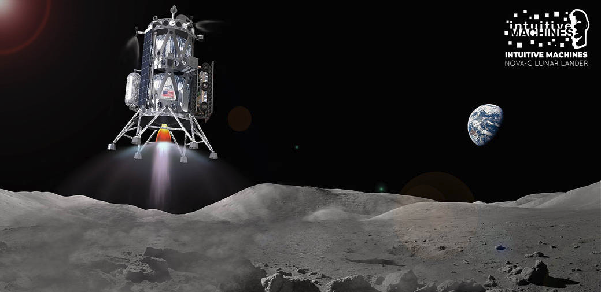

<!-- PROJECT SHIELDS -->

 

  <h1 align="left">AI Agent Learning to Land a Rocket</h1>
  

    Train a <b> Deep Q-Network </b>agent to solve the "Lunar Lander" use case in OpenAI.
     
  

<!-- TABLE OF CONTENTS -->
<!-- ABOUT THE PROJECT -->
## About The Project

